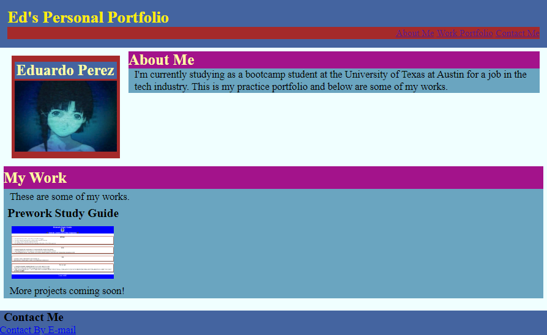

# <Portfolio>
## Description
This application was created to serve as a portfolio so that future employers can see different projects that have been created throughout the course of the coding journey. This web app served as a challenge to make a web app from scratch. I learned more about the syntax needed to make code run the way that is expected.
## Installation
N/A
## Usage

https://kanabaki.github.io/portfolio/

When you load the webpage you can see a header with a navigation section that you can click to jump to different sections on the page. Below that, you can find this developer's name, as well as learn a bit more about them. In the works section you can click on an image to be redirected to a different application. You are also able to see responsive layout that adapts to the viewport.
## Credits
N/A
## License
MIT License

Copyright (c) [2023] [Eduardo Perez]

Permission is hereby granted, free of charge, to any person obtaining a copy
of this software and associated documentation files (the "Software"), to deal
in the Software without restriction, including without limitation the rights
to use, copy, modify, merge, publish, distribute, sublicense, and/or sell
copies of the Software, and to permit persons to whom the Software is
furnished to do so, subject to the following conditions:

The above copyright notice and this permission notice shall be included in all
copies or substantial portions of the Software.

THE SOFTWARE IS PROVIDED "AS IS", WITHOUT WARRANTY OF ANY KIND, EXPRESS OR
IMPLIED, INCLUDING BUT NOT LIMITED TO THE WARRANTIES OF MERCHANTABILITY,
FITNESS FOR A PARTICULAR PURPOSE AND NONINFRINGEMENT. IN NO EVENT SHALL THE
AUTHORS OR COPYRIGHT HOLDERS BE LIABLE FOR ANY CLAIM, DAMAGES OR OTHER
LIABILITY, WHETHER IN AN ACTION OF CONTRACT, TORT OR OTHERWISE, ARISING FROM,
OUT OF OR IN CONNECTION WITH THE SOFTWARE OR THE USE OR OTHER DEALINGS IN THE
SOFTWARE.

---